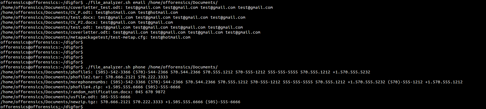

# File-Analyzer

File Analyzer is a tool to looking for patterns in different types of files. Currently it supports two patterns, which are **e-mail addresses** and **phone numbers**. File types it supports are **plain**, **.docx**, **.xlsx**, **.tgz**, **.zip**, **.pdf** and many more. Some of the command-line tools File Analyzer uses are _unzip_, _grep_, and _tr_.

## How to use

File Analyzer takes two command-line parameters. The first parameter should be string _email_ or _phone_, which tells the script what it should look for. The second parameter is the starting directory. The script will try to look for a specified pattern in every file under that directory and its subdirectories.

**Example**

`file_analyzer.sh email /home/offorensics/Documents/`

The example above will look for e-mail addresses under _/home/offorensics/Documents/_. Below is an example output, in which the script is first used to look for e-mail addresses and then for phone numbers.

This information package doesn't intend to dive into more details. If you are interested to know more about this program, please read [Offorensic's article](http://offorensics.com/searching-valuable-information-files-using-bash-shell/ "Offorensic's article") about it.

# Disclaimer

- This script comes without warranty, support or guarantee of effectiveness.

